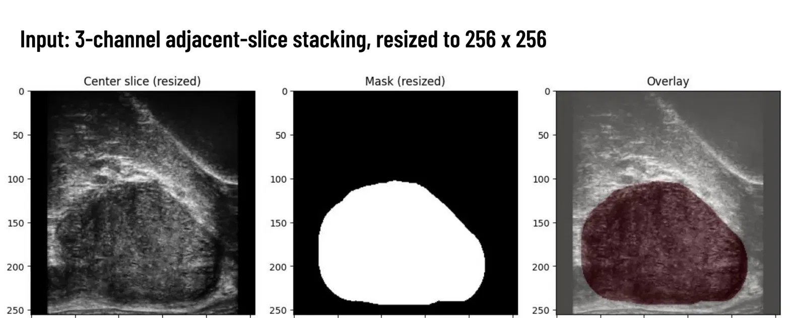
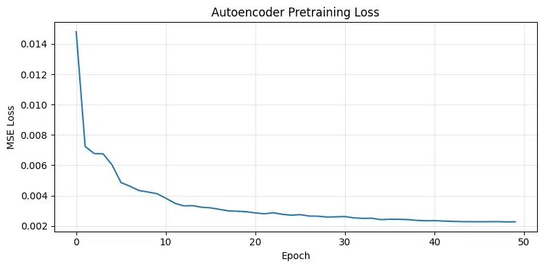
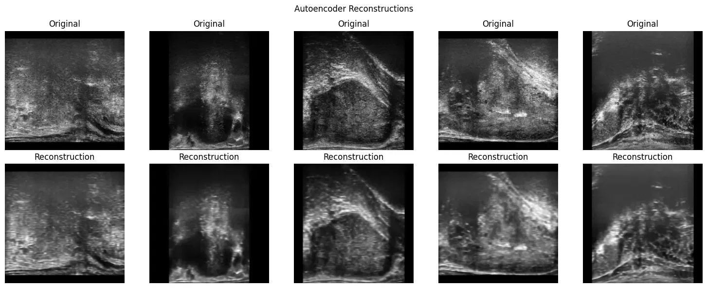
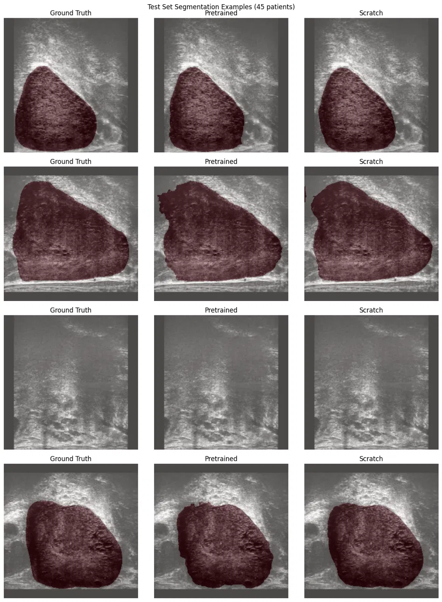
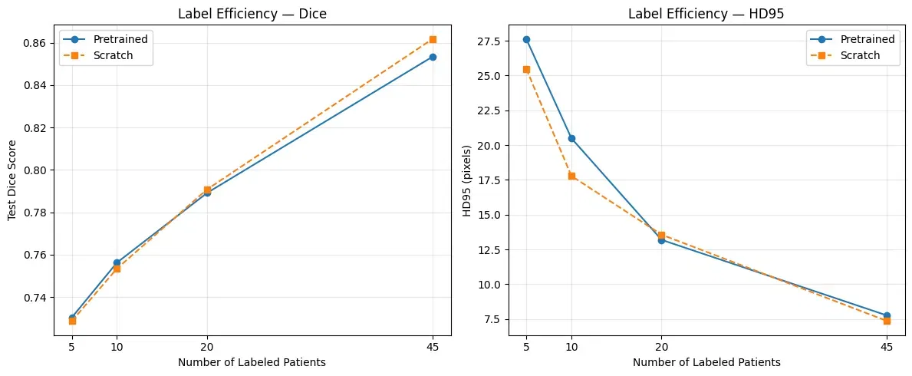
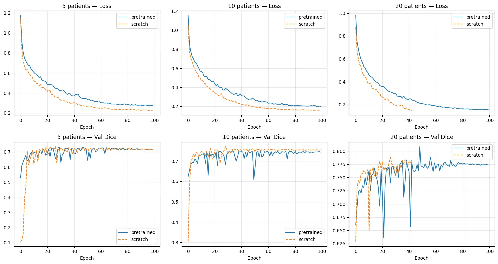

# Self-Supervised Pretraining for Prostate Segmentation on Micro-Ultrasound Images

CS675 Computer Vision Final Project, UMass Boston

**Giorgi Karazanashvili**

## Overview

This project investigates whether self-supervised pretraining on unlabeled micro-ultrasound (micro-US) scans can reduce the number of expert annotations needed to achieve competitive prostate segmentation performance. A convolutional autoencoder is pretrained on 2,152 unlabeled 2D slices from 55 patients, and the learned encoder is transferred into a U-Net for supervised segmentation fine-tuning. The core experiment compares the pretrained U-Net against an identical architecture trained from scratch across varying amounts of labeled data (5, 10, 20, and 45 patients).



## Dataset

The [Micro-Ultrasound Prostate Segmentation Dataset](https://zenodo.org/records/10475293) consists of 75 micro-US volumes in NIfTI format, split into 55 training and 20 test patients. Micro-US operates at 29 MHz (roughly 4x conventional ultrasound frequency), producing high-resolution images of prostate tissue microstructure. Each volume has spatial dimensions of 1372 x 962 pixels with 33-45 axial slices per patient.

Each input is constructed as a 3-channel image by stacking the previous, current, and next axial slice for spatial context along the depth axis. All slices are resized to 256 x 256 and normalized to [0, 1].

## Approach

### Autoencoder Pretraining

The encoder has four downsampling stages (64/128/256/512 channels), each with two 3x3 convolution layers, batch normalization, and ReLU activation, followed by 2x2 max pooling. For pretraining, the encoder is paired with a simple upsampling decoder that does not use skip connections, forcing the 32 x 32 x 512 bottleneck to encode all information needed for reconstruction.

The autoencoder is trained for 50 epochs on all 2,152 SSL slices using MSE reconstruction loss, Adam optimizer with learning rate 1e-3, and cosine annealing schedule.





### U-Net Fine-Tuning

For segmentation, the pretrained encoder is attached to a U-Net decoder with skip connections from all four encoder levels. The combined loss is Dice loss plus binary cross-entropy. Training uses Adam optimizer with learning rate 1e-4, cosine annealing schedule, and runs for 100 epochs with the best model selected by validation Dice score.

## Results

### Full-Label Segmentation (45 patients)

| Model | Dice | HD95 (px) |
|-------|------|-----------|
| Pretrained | 0.853 | 7.75 |
| Scratch | 0.862 | 7.36 |

With all 45 labeled patients, the scratch U-Net slightly outperforms the pretrained model on both metrics.



### Label-Efficiency Experiment

Both models were trained at 5, 10, 20, and 45 labeled patients. Pretraining provides a small Dice advantage at 5 patients (+0.17%) and 10 patients (+0.28%), but the gap closes by 20 patients and reverses at 45. On HD95, scratch actually outperforms pretrained at 5 and 10 patients, indicating tighter boundary predictions despite slightly lower overlap.



Training curves reveal that the primary benefit of pretraining is faster convergence rather than improved final accuracy. At 5 patients, the pretrained model starts at a validation Dice of roughly 0.5 while scratch starts near 0.1, but scratch catches up by epoch 20-30.



## Key Findings

- Reconstruction-based self-supervised pretraining offers limited label-efficiency gains on this dataset
- The pretrained model learns texture and global structure but not boundary-specific features, which explains why Dice shows marginal improvement while HD95 does not benefit
- The main practical advantage of pretraining is faster convergence, which could be valuable under limited compute budgets or early stopping
- All differences across label conditions are less than 1% Dice and likely within noise for a 20-patient test set

## Repository Structure

```
├── CS675_Project.ipynb                                          # Full pipeline (data loading through evaluation)
├── CS675_SSL Prostate Segmentation_Giorgi_Karazanashvili.pdf     # Report 
├── cs675_ProstateSegmentation.pptx                              # Slides
├── figures/                                                     # Result figures
└── README.md
```

## References

1. H. Jiang et al., "MicroSegNet: A deep learning approach for prostate segmentation on micro-ultrasound images," *Computerized Medical Imaging and Graphics*, 2024.
2. M. Imran et al., "AI-enhanced micro-ultrasound improves detection of clinically significant prostate cancer at biopsy," *BJUI Compass*, 2026.
3. W. Shao and N. Brisbane, "Micro-Ultrasound Prostate Segmentation Dataset," Zenodo, 2024. [Link](https://zenodo.org/records/10475293)

## License

MIT
